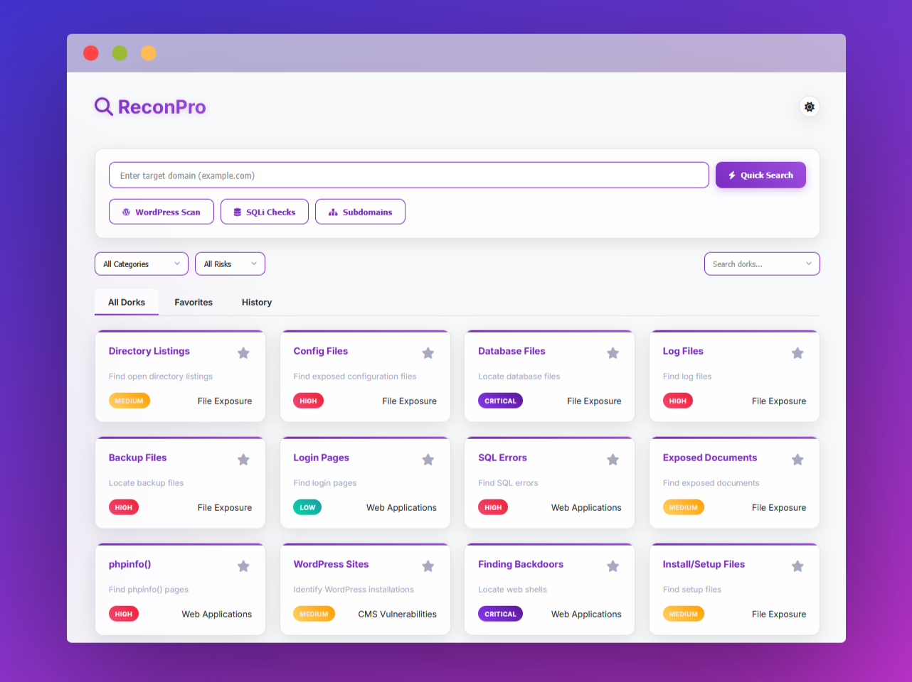

# 🔍 ReconPro - Ultimate Google Dorking Tool for Bug Bounty & Pentesting


## 🌟 Live Demo
➡️ **Use ReconPro Now: [https://iamshafayat.github.io/ReconPro/](https://iamshafayat.github.io/ReconPro/)**


## 🌟 Introduction

ReconPro is a specialized web reconnaissance tool designed for cybersecurity professionals and bug bounty hunters. It provides instant access to carefully curated Google dorks organized by vulnerability type and risk level, significantly accelerating the initial reconnaissance phase of security assessments.


## 🚀 Key Features

### 🔥 Core Functionality
- **Pre-loaded Dorks** covering:
  - File exposures (configs, backups, logs)
  - CMS vulnerabilities (WordPress, Drupal, Joomla)
  - Database exposures (SQLi patterns, DB files)
  - Domain intelligence (subdomains, certificates)
- **Smart Preset System** for common reconnaissance scenarios
- **Cross-platform** - Runs in any modern browser

### 🎨 UX Features
- Dual theme system (light/dark mode)
- Favorites management
- Search history tracking
- Interactive query previews
- Responsive design (works on mobile/desktop)

### ⚙️ Technical Features
- Zero external dependencies
- Local storage persistence
- Custom dork selection interface

## 🛠️ Usage Guide
### Basic Flow:
1. Visit **[https://iamshafayat.github.io/ReconPro/](https://iamshafayat.github.io/ReconPro/)**
2. Enter target (e.g., `example.com`)
3. Select dorks:
   - Browse all (filter by category/risk)
   - Use presets (WordPress/SQLi/Subdomains)
4. Click to execute searches in new tabs

### Preset Collections:
| Preset        | Dorks Included | Description |
|---------------|----------------|-------------|
| WordPress Scan | 9 dorks | Finds configs, backups, plugins |
| SQLi Checks   | 3 dorks | Identifies SQL injection points |
| Subdomains    | 3 dorks | Discovers subdomains |

## 🤝 Contributing
We welcome dork submissions and improvements!
1. Fork the repository
2. Add new dorks to dorkDatabase in script.js
3. Submit a pull request

## 🗃️ Dork Database
Structured with:
```javascript
{
  id: {
    name: "Dork Name",
    dork: "actual_query",
    category: "File Exposure", 
    risk: "critical|high|medium|low",
    description: "What it detects"
  }
}
```

## ⚠️ Ethical Guidelines
ReconPro must only be used on systems you own or have explicit permission to test. Users are responsible for complying with all applicable laws and terms of service.

## 📜 License
[](LICENSE)

---------------
Made with ❤️ by [Shafayat Ahmed Alif](https://www.linkedin.com/in/iamshafayat/) for Security Researchers
